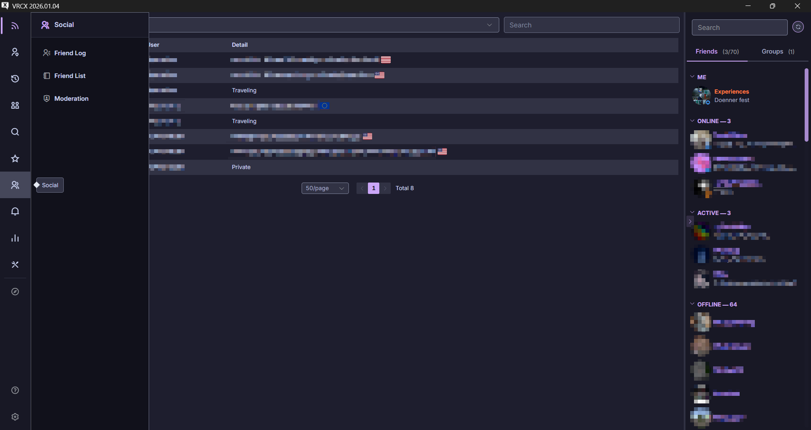
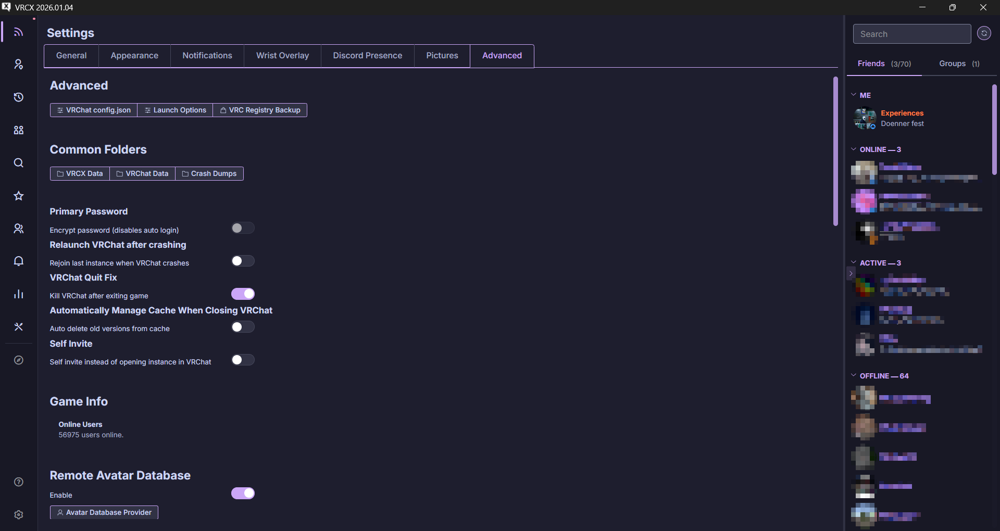
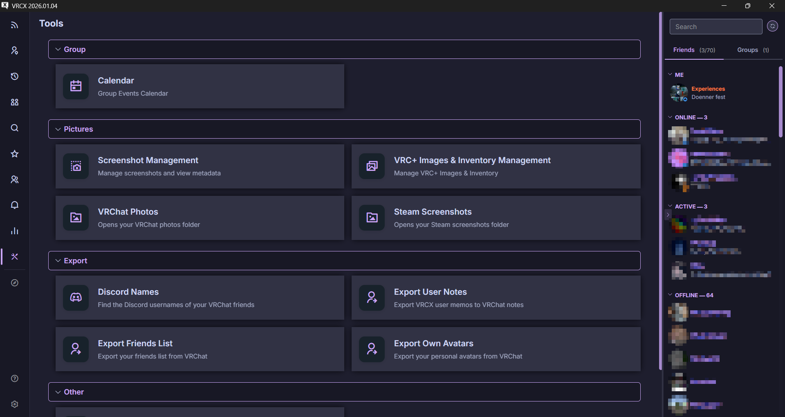

<h3 align="center">
   
  
  Catppuccin Mocha for <a href="https://github.com/vrcx-team/VRCX">VRCX</a>
  
</h3>

  
  
  

## Previews

Feed & Social

Settings

Tools

## Installation

> [!IMPORTANT]
> Set VRCX's theme to **Dark** in Settings → Appearance for the intended appearance. This theme is designed for dark mode and may not display correctly with other themes.

### Method 1: Direct File Placement
1. Download [`custom.css`](src/custom.css) from this repository
2. Open the VRCX data folder:
   - **Via VRCX**: Settings → Advanced → Common Folders → VRCX Data
   - **Via Windows**: Press `WIN`+`R` and paste `%appdata%\VRCX`
3. Place `custom.css` in the root of this folder  
   Example path: `C:\Users\YourUsername\AppData\Roaming\VRCX\custom.css`
4. Restart VRCX by pressing `CTRL`+`R` or restarting the application

### Method 2: Manual Copy-Paste
1. Copy the contents of [`custom.css`](src/custom.css)
2. Navigate to VRCX data folder (see Method 1, step 2)
3. Create a new file named `custom.css` and paste the content
4. Restart VRCX with `CTRL`+`R`or restarting the application

## Color Palette

This theme uses the Catppuccin Mocha flavor with mauve as the primary accent color. You can find the full color palette [here](https://catppuccin.com/palette/)

## Contributing

Contributions, issues, and suggestions are welcome!

**How to contribute:**
1. Open an [issue](https://github.com/ExperiencesXP/VRCX-Catppuccin/issues)
2. Fork the repository and make your changes
3. Submit a pull request (include screenshots pls)

## License

This project is licensed under MIT.

See [LICENSE](LICENSE) for details.

  

